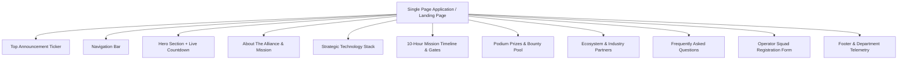

# HACK_NEXUS 1.0 — Master Website Content & Specification Brief

> **Purpose:** This document is the complete, UI-agnostic content specification and copy deck for **HACK_NEXUS 1.0**. It is structured for designers and frontend developers to construct a brand-new website with any design system, layout aesthetic, or component library.

---

## 1. Brand & Event Identity

| Attribute | Specification |
| :--- | :--- |
| **Event Name** | `HACK_NEXUS 1.0` |
| **Event Type** | National-Level Technical Make-a-Thon / Hackathon |
| **Sprint Duration** | `10 Hours` (Uninterrupted clean-room build sprint) |
| **Event Dates** | October 8–9, 2026 |
| **Hackathon Kickoff** | October 8, 2026 at 09:00 AM IST (Reporting at 08:30 AM IST) |
| **Target Countdown Date** | `2026-10-08T09:00:00+05:30` |
| **Venue / Physical Location** | CSE Advanced Computing Lab, Room 402, Block C |
| **Host Organization** | Department of Computer Science & Engineering (CSE) |
| **Core Theme / Slogan** | *"Anyone Can Wear The Mask"* |
| **Primary Tagline** | *"10 Hours. Infinite Possibilities. Create Beyond Limits."* |
| **Secondary Motto** | *"With Great Power Comes Great Innovation"* |
| **Prize / Bounty Pool** | `₹18,000+` Total Cash Pool + Trophies & Incubation Passes |
| **Target Audience** | Undergraduate & Postgraduate engineering, AI, and CS students (Squads of 2–4 builders) |

---

## 2. Information Architecture & Sitemap



### Navigational Anchor Map
- `#hero` ➔ Hero & Countdown
- `#about` ➔ About The Alliance & Mission
- `#stack` ➔ Strategic Tech Stack
- `#timeline` ➔ 10-Hour Mission Timeline
- `#prizes` ➔ Rewards & Bounty Pool
- `#faq` ➔ Frequently Asked Questions
- `#register` ➔ Squad Registration Portal

---

## 3. Global Elements & Navigation

### 3.1 Top Announcement Ticker (Marquee or Banner)
*Displays looping real-time event alerts across the top edge.*
1. `● HACK_NEXUS 1.0`
2. `// NATIONAL LEVEL MAKE-A-THON`
3. `// 10-HOUR BUILD SPRINT`
4. `// CSE ADVANCED COMPUTING LAB`
5. `● ₹18,000+ BOUNTY POOL`
6. `// 4 TACTICAL DOMAINS`
7. `// STATUS: REGISTRATION LIVE`
8. `// ANYONE CAN WEAR THE MASK`

---

### 3.2 Navigation Header
*Persistent or sticky navigation bar.*
- **Brand Logo Text:** `HACK_NEXUS`
- **Brand Sub-text:** `1.0 // CSE INNOVATION ALLIANCE`
- **Menu Links:**
  - `About` ➔ `#about`
  - `Tech Stack` ➔ `#stack`
  - `Timeline` ➔ `#timeline`
  - `Prizes` ➔ `#prizes`
  - `FAQ` ➔ `#faq`
- **Primary Header CTA Button:** `REGISTER NOW` ➔ `#register`

---

### 3.3 Optional Floating / Ambient Elements
*Interactive widgets to enrich the UI layout.*
- **Floating Bounty Token:**
  - Label: `TOTAL BOUNTY`
  - Value: `₹18,000 POOL`
  - Icon: 🏆
- **Scroll Progress / Depth Rail:**
  - Displays numbered section indicators (`01 HERO`, `02 ABOUT`, `03 TECH STACK`, `04 TIMELINE`, `05 PRIZES`, `06 FAQ`, `07 REGISTER`) and current scroll depth percentage (`0% – 100%`).

---

## 4. Hero Section

### 4.1 Header Badges & Typography
- **Eyebrow / Kicker Badge:**
  `NATIONAL LEVEL HACKATHON // OCT 8-9, 2026`
- **Main Monumental Heading:**
  `HACK_NEXUS`
- **Sprint Duration Badge:**
  `10 HOURS`
- **Tagline:**
  `INFINITE POSSIBILITIES. CREATE BEYOND LIMITS.`
- **Venue & Sub-headline:**
  `"ANYONE CAN WEAR THE MASK" // CSE ADVANCED COMPUTING LAB // VENUE 402`

---

### 4.2 Dynamic Live Countdown Timer
*Calculates remaining duration until: `October 8, 2026 at 09:00 AM IST`.*
- **Unit 1:** `[Days]` `DAYS`
- **Unit 2:** `[Hours]` `HOURS`
- **Unit 3:** `[Minutes]` `MINS`
- **Unit 4:** `[Seconds]` `SECS`
- *Fallback when reached:* `00 DAYS 00 HOURS 00 MINS 00 SECS` (Status: `MISSION ACTIVE // HACKATHON COMMENCED`)

---

### 4.3 Action Buttons
- **Primary Action (High visual priority):**
  - Text: `REGISTER NOW`
  - Destination: `#register`
  - Icon: Arrow or Launch Icon
- **Secondary Action (Subtle / Outline / Ghost):**
  - Text: `MISSION TIMELINE ↓`
  - Destination: `#timeline`

---

## 5. About & Mission Section

### 5.1 Section Header
- **Main Heading:**
  `ANYONE CAN WEAR THE MASK`
- **Subtitle Copy:**
  `HACK_NEXUS 1.0 IS THE PREMIER FAST-PACED INVENT-A-THON WHERE COGNITIVE ARCHITECTURES MEET CUTTING-EDGE HARDWARE.`

---

### 5.2 Card A: Flagship Innovation Event
- **Eyebrow Tag:** `FLAGSHIP SYNERGY // 2026`
- **Card Title:** `10 HOURS OF UNRELENTING CREATION`
- **Body Copy:**
  > "Step into an arena purpose-built for hackers who refuse to accept cookie-cutter paradigms. Over ten intense hours, student engineers, AI practitioners, and hardware tinkerers converge to convert theoretical concepts into verified, high-throughput deployments."
- **Key Statistics Matrix:**
  - `10` — `HOURS SPRINT`
  - `₹18K` — `BOUNTY POOL`
  - `400+` — `OPERATORS`
  - `50+` — `HARDWARE MENTORS`

---

### 5.3 Card B: Organizing Alliance & Department
- **Eyebrow Tag:** `ALLIANCE NETWORK // CSE DEPT × AFFILIATES`
- **Card Title:** `DEPARTMENT OF COMPUTER SCIENCE & ENGINEERING`
- **Body Copy:**
  > "Presented under the academic patronage of premier university bodies and student-led engineering fraternities, dedicated to fostering an open ecosystem of inter-disciplinary technological execution."
- **Participating Bodies & Roles:**
  1. **Cyber Synth Society** — *Host & Tech Architecture*
  2. **IETE-SF Student Forum** — *Technical Affiliate*
  3. **RACE & ACM Chapter** — *Operations & Logistics*
  4. **ECEA Student Wing** — *Hardware & IoT Expansion*

---

### 5.4 Card C: The Mission & Core Philosophy
- **Eyebrow Tag:** `THE MISSION`
- **Card Title:** `BUILD. COMPETE. INNOVATE.`
- **Body Copy:**
  > "Participants take on real-world, industry-vetted problem statements, explore emergent models and distributed protocols, and engineer operational prototypes in a rapid-paced sprint."
- **Three Strategic Pillars:**
  1. ✦ **Innovation:** *Novel architecture beats rote clones.*
  2. ⚡︎ **Collaboration:** *Synergistic squads of 2–4 builders.*
  3. ⚙ **Hands-On Sprint:** *10 hours of code, zero filler.*

---

## 6. Strategic Technology Stack Section

### 6.1 Section Header
- **Eyebrow Tag:** `// STRATEGIC TECHNOLOGY STACK //`
- **Main Heading:** `STRATEGIC TECH STACK`
- **Subtitle Copy:**
  `Strategic partner technologies available in your solution architecture. Integrating these platforms unlocks verification points and specialized bounty grants.`

---

### 6.2 Partner Technology Modules
Each item represents a core platform recommended for squad deliverables:

#### 1. Google Gemini
- **Category:** `AI REASONING & VISION`
- **Stack Tag:** `STACK // GEMINI`
- **Headline:** `Google Gemini`
- **Technical Scope:** 2M+ token multimodal reasoning, structured JSON tool execution, image/document OCR, and low-latency Flash inference.
- **Suggested Icon/Graphic:** Multimodal / Starburst / AI Chip

#### 2. MongoDB Atlas
- **Category:** `DATA & VECTOR SEARCH`
- **Stack Tag:** `STACK // MONGODB`
- **Headline:** `MongoDB Atlas`
- **Technical Scope:** Vector search embeddings, dynamic document collections, time-series telemetry streams, and shared multi-agent state.
- **Suggested Icon/Graphic:** Database / Vector Leaf

#### 3. Render Cloud
- **Category:** `DEPLOYMENT & HOSTING`
- **Stack Tag:** `STACK // RENDER`
- **Headline:** `Render Cloud`
- **Technical Scope:** Zero-configuration Git push CI/CD, auto-scaling microservices, containerized API services, and public live URLs.
- **Suggested Icon/Graphic:** Lightning / Cloud Server

#### 4. Blockchain / Web3
- **Category:** `SMART CONTRACTS`
- **Stack Tag:** `STACK // BLOCKCHAIN`
- **Headline:** `Blockchain / Web3`
- **Technical Scope:** EVM smart contracts deployed to public testnets (Sepolia / Polygon Amoy) for tamper-proof verification, escrows, and auditability.
- **Suggested Icon/Graphic:** Decentralized Blocks / Cryptographic Seal

#### 5. Multi-Agent Systems
- **Category:** `COLLABORATIVE SWARMS`
- **Stack Tag:** `STACK // MULTI-AGENT`
- **Headline:** `Multi-Agent Systems`
- **Technical Scope:** Autonomous coordinator logic, risk/action evaluation councils, decentralized agent swarms, and shared-state convergence.
- **Suggested Icon/Graphic:** Network Swarm / Autonomous Bot

---

## 7. Official 10-Hour Mission Timeline

### 7.1 Protocol Telemetry Header
- **Eyebrow Tag:** `// 10-HOUR MAKEATHON PROTOCOL //`
- **Main Heading:** `MISSION TIMELINE`
- **Subtitle:** `Minute-by-minute tactical execution rhythm of the 10-hour build sprint.`
- **Status Dashboard Indicators:**
  - `SPRINT DURATION:` **10.0 Hours**
  - `CHECKPOINTS:` **5 Gates Verified**
  - `ACTIVE ZONE:` **Lab Pods 1–12**
  - `BUS STATUS:` **Synchronized**

---

### 7.2 Chronological Checkpoints & Evaluation Gates

| Gate | Time Interval | Gate Identifier & Badge | Phase Title & Description | Venue | Milestones & Criteria |
| :--- | :--- | :--- | :--- | :--- | :--- |
| **01** | **08:30 AM – 09:00 AM** | `GATE 01`<br>`REPORTING & COMMENCEMENT` | **Squad Reporting & Hackathon Commencement**<br>Reporting starts at 08:30 AM with biometric squad verification, hacker badge dispatch, and terminal setup. The hackathon officially commences promptly at 09:00 AM with the release of problem parameters and live countdown. | Main Lobby & CSE Atrium | Biometric check-in, kit collection, hardware workstation initialization. Sprint clock starts strictly at 9:00 AM. |
| **02** | **11:00 AM Onwards** | `GATE 02`<br>`REVIEW 01` | **Review 1 // Ideation, Scope & Architecture Checkpoint**<br>Review 1 commences at 11:00 AM. Jury panel and industry mentors evaluate problem statement choice, design wireframes, initial system architecture, schema modeling, and sprint feasibility. | Round-Robin Review Pods | Mentor sign-off on architecture baseline, database schema, and project boundaries. |
| **03** | **03:00 PM Onwards** | `GATE 03`<br>`REVIEW 02` | **Review 2 // Core Logic & MVP Integration Audit**<br>Review 2 starts at 3:00 PM. In-depth technical critique of working backend APIs, database connections, vector search pipelines, and end-to-end user workflows. | Lab Pods 1–12 | Live endpoint demonstrations, database query testing, baseline UI/backend integration. |
| **04** | **06:00 PM Onwards** | `GATE 04`<br>`REVIEW 03` | **Review 3 // Final Code Audit & Deployment Staging**<br>Review 3 starts at 6:00 PM. Pre-freeze comprehensive inspection of deployed cloud services, UI/UX polish, test coverage, edge-case resilience, and pitch dry-run preparations. | Lab Pods 1–12 | Public deployment verification, test coverage checks, slide deck dry-run. |
| **05** | **07:30 PM** | `GATE 05`<br>`HACKATHON END` | **Hackathon Concludes // Code Freeze & Grand Valedictory**<br>Hackathon officially ends at 7:30 PM with final code freeze and repository lockdown. Top finalist squads present live prototype pitches before the grand jury, followed by valedictory awards and ₹18,000 bounty distribution. | Main Auditorium & Audi Stage | Strict GitHub commit freeze, 3-minute stage pitch, jury Q&A, trophy and cash prize distribution. |

---

### 7.3 Operational Sustenance & Sprint Timer Advisory
- **Alert Badges:** `// OPERATIONAL SPRINT ADVISORY //` | `MEALS & REFRESHMENTS PROVIDED` | `CONTINUOUS SPRINT TIMER` | `NO MIDWAY PAUSE`
- **Advisory Content:**
  > *"Complimentary lunch, high-energy refreshments, and continuous hot beverages will be provided on-site throughout the event. Please note that the 10-hour hackathon timer runs continuously without pause during lunch and mid-sprint intervals. Participating squads are advised to stagger meal breaks internally to maintain uninterrupted development velocity."*

---

## 8. Prizes & Recognition

### 8.1 Section Header
- **Eyebrow Tag:** `// REWARDS & RECOGNITION //`
- **Main Heading:** `PRIZES & RECOGNITION`
- **Subtitle:** `Official cash prize pool, venture acceleration fast-track, and trophies for top podium finishers.`

---

### 8.2 Podium Breakdown

#### Rank 01: Grand Champion (Centerpiece Award)
- **Podium Rank:** `RANK 01`
- **Award Title:** `GRAND CHAMPION`
- **Cash Prize:** `₹10,000`
- **Perks & Honors:**
  - The prestigious HACK_NEXUS 1.0 Trophy
  - Patent filing sponsorship & IP legal advisory
  - Direct technology incubator fast-track pass
  - Exclusive partner company mentorship

#### Rank 02: First Runner Up
- **Podium Rank:** `RANK 02`
- **Award Title:** `RUNNER UP`
- **Cash Prize:** `₹5,000`
- **Perks & Honors:**
  - Direct fast-track interview pass with partner technology firms
  - Incubator guidance & venture advisory sessions
  - Official Certificate of Technical Excellence

#### Rank 03: Second Runner Up
- **Podium Rank:** `RANK 03`
- **Award Title:** `RUNNER UP`
- **Cash Prize:** `₹3,000`
- **Perks & Honors:**
  - Honored for exceptional technical design execution rhythm and real-world architectural utility
  - Official Certificate of Technical Merit

---

## 9. Sponsors & Partner Ecosystem

### 9.1 Section Header
- **Eyebrow Tag:** `// THE ECOSYSTEM //`
- **Main Heading:** `POWERED BY INDUSTRY LEADERS`

### 9.2 Partner Entities
1. **Gemini Core** — *Multimodal Intelligence Partner*
2. **MongoDB Atlas** — *Database & Vector Search Partner*
3. **Render Cloud** — *Cloud Hosting & Infrastructure Partner*
4. **Polygon Labs** — *Web3 & Scalable Blockchain Partner*
5. **GitHub Campus** — *Developer Tools Partner*
6. **IEEE Advanced Lab** — *Academic & Research Affiliate*

---

## 10. Frequently Asked Questions (FAQ)

### 10.1 Section Header
- **Eyebrow Tag:** `// PROTOCOL CLARIFICATIONS //`
- **Main Heading:** `FREQUENTLY ASKED QUESTIONS`
- **Subtitle:** `Everything you need to know about eligibility, sprint rules, and judging criteria.`

---

### 10.2 Q&A Catalog (Accordion Component)

#### Q1: Who is eligible to participate in HACK_NEXUS 1.0?
> **Answer:** Participation is open to all enrolled undergraduate and postgraduate students from any recognized university or college. Inter-departmental and inter-year squads consisting of 2 to 4 operators are highly encouraged.

#### Q2: Can we use pre-existing codebases or templates?
> **Answer:** All core problem logic must be authored entirely during the 10-hour clean sprint. Standard open-source libraries, open UI components, and framework scaffolds (Next.js, FastAPI, Vite, etc.) are fully allowed.

#### Q3: What physical amenities and computing hardware are provided?
> **Answer:** Dedicated team pod desks in CSE Advanced Lab 402 with high-speed Gigabit LAN, uninterrupted power rails, external secondary monitors, round-the-clock coffee and refreshments, and on-site faculty & mentor access.

#### Q4: How does the final pitch and valedictory evaluation operate?
> **Answer:** Each squad receives a strict 3-minute live prototype demonstration projected in the main auditorium, followed by a 2-minute technical architectural Q&A with the industry panel. Working deployments on cloud qualify for track points.

#### Q5: Will the 10-hour timer pause for lunch or refreshments?
> **Answer:** No. The 10-hour sprint timer runs continuously without stoppage throughout the hackathon. High-energy lunch and continuous refreshments will be catered directly on-site, and squads should stagger meal breaks internally to preserve development velocity.

#### Q6: What technologies can squads leverage?
> **Answer:** Squads can integrate partner technologies including Google Gemini (multimodal AI reasoning), MongoDB Atlas (vector search & operational state), Render Cloud (deployment), Web3 smart contracts, and Multi-Agent frameworks to power their solutions.

---

## 11. Squad Registration Portal

### 11.1 Section Header
- **Eyebrow Tag:** `// SECURE UPLINK // HACK_NEXUS 1.0`
- **Main Heading:** `OPERATOR REGISTRATION`
- **Security Clearance Badge:** `SEC_LEVEL: 01`

---

### 11.2 Form Specification & Field Architecture

| Field # | Field Label | Input Type | Validation / Constraints | Placeholder Example |
| :--- | :--- | :--- | :--- | :--- |
| **01** | `Team Call-Sign *` | Text Input | Required, 3–30 characters | `e.g. SPIDER_BYTE_OPS` |
| **02** | `Lead Operator Email *` | Email Input | Required, valid academic/personal email | `lead@univ.edu` |
| **03** | `Target Domain *` | Dropdown Select | Required, default first item | 4 Domain options (see list below) |
| **04** | `Squad Size *` | Dropdown Select | Required | `2 Operators`, `3 Operators`, `4 Operators` |
| **05** | `Target Problem Statement (Optional)` | Grouped Select | Optional | 15 statements grouped by domain + Open option |
| **06** | `Project Architecture Abstract` | Multi-line Textarea | Optional, 3 rows | `Outline the technical concept your team will engineer inside the 10-hour sprint...` |
| **07** | `Code of Conduct Agreement *` | Checkbox | Required (`checked=true`) | *"We pledge to abide by the CSE Lab Code of Conduct and honor the 10-hour clean room sprint rules."* |
| **08** | `Submit Action` | Button | Triggers form submit | Default: `TRANSMIT SQUAD REGISTRATION`<br>Submitting: `TRANSMITTING TELEMETRY...` |

#### Dropdown Choices for "Target Domain":
1. `Domain 01 // AI & ML (HN-AI)`
2. `Domain 02 // Cybersecurity & Blockchain (HN-CS)`
3. `Domain 03 // FinTech (HN-FT)`
4. `Domain 04 // Cross-Domain (HN-X)`

#### Dropdown Choices for "Target Problem Statement":
- **AI & ML:**
  - `HN-AI-01 // Campus Knowledge Agent`
  - `HN-AI-02 // Smart Complaint Triage for Civic Bodies`
  - `HN-AI-06 // Accessibility Auditor for Campus & Civic Websites`
  - `HN-AI-05 // Cross-Hospital Resource Rebalancer`
- **Cybersecurity & Blockchain:**
  - `HN-CS-01 // Phishing Shield`
  - `HN-CS-02 // Secure Passwordless Login Kit`
  - `HN-CS-03 // Log Sentinel: AI-Assisted Threat Detection`
  - `HN-CS-04 // Tamper-Proof Academic Credential Verification`
  - `HN-CS-05 // Farm-to-Fork Supply Chain Tracker`
  - `HN-CS-06 // Transparent Donation & Fund Tracking`
  - `HN-CS-07 // Decentralized Freelance Escrow`
- **FinTech:**
  - `HN-FT-01 // Smart Expense Companion for Students & Gig Workers`
  - `HN-FT-04 // Multi-Agent Portfolio Rebalancer`
  - `HN-FT-06 // SME Cash Flow Forecasting`
- **Cross-Domain:**
  - `HN-X-02 // Disaster Response Coordination Platform`
- **Undecided:**
  - `OPEN // Undecided (Finalize at Keynote)`

---

### 11.3 Post-Submission Feedback State
- **Success Icon:** 🚀
- **Success Title:** `TRANSMISSION SUCCESSFUL`
- **Confirmation Message:** `Squad [{Team Call-Sign}] registered for HACK_NEXUS 1.0!`
- **Instruction Note:** `Telemetry dispatch sent to {Lead Email}. Please verify Discord uplink for check-in credentials.`
- **Secondary Action:** `REGISTER ANOTHER SQUAD` (Resets form)

---

## 12. Footer & Organization Directory

### 12.1 Status & Telemetry Banner
- **Status Indicator:** `● SYSTEM TELEMETRY: ALL CLEAR`
- **Divider:** `|`
- **Sub-status:** `LAB 402 HOST PODS ONLINE`
- **Motto:** `MOTTO: "WITH GREAT POWER COMES GREAT INNOVATION"`

---

### 12.2 Column 1: Organization & Identity
- **Logo / Heading:** `HACK_NEXUS 1.0`
- **Tag:** `VISION // CSE DEPT`
- **Description:** `National flagship 10-hour technical make-a-thon organized by the Department of Computer Science & Engineering.`

---

### 12.3 Column 2: Tactical Navigation
- `> About The Alliance` ➔ `#about`
- `> Strategic Tech Stack` ➔ `#stack`
- `> 10-Hour Timeline` ➔ `#timeline`
- `> Prize & Bounty Pool` ➔ `#prizes`

---

### 12.4 Column 3: Mission Command (Leadership)
- **Section Heading:** `MISSION COMMAND`
- **Faculty Patron:** Dr. V. R. Sharma
- **Student Convener:** Aarav Mehta
- **Tech Ops Lead:** Priya Nair
- **Lab Director:** Prof. K. Sundaram

---

### 12.5 Column 4: Secure Communication Channels
- **Section Heading:** `SECURE COMM CHANNELS`
- **Uplink Email:** `hacknexus@cse.edu`
- **Discord:** `discord.gg/hacknexus`
- **Phone / Hotline:** `+1 (800) 555-TECH`
- **Physical Room:** `CSE Lab 402, Block C`

---

### 12.6 Bottom Legal & Copyright Bar
- **Copyright Statement:** `© 2026 DEPT OF COMPUTER SCIENCE & ENGINEERING. ALL SYSTEM RIGHTS RESERVED.`
- **Policy Links:**
  - `CODE OF CONDUCT`
  - `LAB SAFETY`
  - `PRIVACY PROTOCOL`

---

## 13. Complete Problem Statements & Challenge Library

*This library contains all 15 problem statements across 4 competitive domains for implementation as an interactive filter, grid, card list, or modal drawer in the new UI.*

### Domain 01: Artificial Intelligence & Machine Learning (HN-AI)
*Autonomous reasoning engines, multimodal vision comprehension, and predictive real-time optimization models.*

#### 1. HN-AI-01 // Campus Knowledge Agent
- **Domain:** AI & ML
- **The Problem:** Students waste hours searching for circulars, syllabi, exam timetables, and department notices scattered across PDFs, WhatsApp groups, and notice boards.
- **The Challenge:** Build an AI assistant that ingests institutional documents and answers student queries in natural language. Every answer must cite its source document.
- **Core Deliverable:** Upload 5+ PDFs and get a chat interface with grounded answers and source citations. Documents and vector embeddings are stored in MongoDB Atlas.
- **Stretch Goals:** Tamil/English bilingual answers, an 'I don't know' fallback when the answer is not in the documents, and admin analytics on the most-asked questions.

#### 2. HN-AI-02 // Smart Complaint Triage for Civic Bodies
- **Domain:** AI & ML
- **The Problem:** Municipal grievance portals receive thousands of unstructured complaints, often with photos. These are sorted and routed by hand, which causes long delays.
- **The Challenge:** Build a system that takes a complaint as text and/or image, classifies its category and urgency, extracts the location, detects duplicates, and routes it to the right department.
- **Core Deliverable:** A submission form with multimodal classification using Gemini vision and text, an auto-assigned department and priority score, and a dashboard showing complaints by category.
- **Stretch Goals:** Merging duplicate complaints, an interactive map heatmap view, and SLA breach alerts.

#### 3. HN-AI-06 // Accessibility Auditor for Campus & Civic Websites
- **Domain:** AI & ML
- **The Problem:** Most college and municipal websites fail basic accessibility standards — poor contrast, missing alt text, unlabeled form fields — locking out visually or motor-impaired users, and manual audits are slow and rarely repeated.
- **The Challenge:** Build a tool that scans a given webpage (URL or uploaded HTML) and flags concrete violations with the exact element at fault, plus a ready-to-use fix for each.
- **Core Deliverable:** URL/HTML input, automated detection for 3 violation categories (alt text, contrast, form labels), a report listing each violation with its element and severity, and a Gemini-generated fix suggestion per violation, logged to MongoDB.
- **Stretch Goals:** A 4th violation category (heading structure), a before/after live preview applying fixes, and a downloadable patch file.

#### 4. HN-AI-05 // Cross-Hospital Resource Rebalancer
- **Domain:** AI & ML
- **The Problem:** Existing bed/oxygen/ventilator dashboards only show each hospital's own stock in isolation — nobody looks across hospitals in the same district to notice that Hospital A is about to run short while Hospital B has spare capacity sitting idle.
- **The Challenge:** Using a small simulated live feed (5–6 hospitals, one resource type e.g. oxygen cylinders, updated every few seconds), build a system that predicts which hospital will run short within the next few hours using a lightweight trend model, and simultaneously recommends a specific transfer (from which hospital, how much, by when) to prevent it — turning prediction into an actionable redistribution plan, not just a warning.
- **Core Deliverable:** Simulated multi-hospital resource stream written to MongoDB → simple trend-based shortage predictor per hospital (e.g., linear depletion rate) with a visible confidence/accuracy check against held-out simulated data → dashboard showing live stock per hospital, predicted time-to-shortage, and a ranked transfer recommendation → Gemini-generated one-line justification per recommendation ('Move 40 units from B to A — B has 6hrs surplus, A depletes in 2hrs').
- **Stretch Goals:** Multi-resource tracking (beds + oxygen), automated distance-aware transit routing, and emergency escalation alerts.

---

### Domain 02: Cybersecurity & Blockchain (HN-CS)
*Threat intelligence, passwordless identity perimeters, phishing defense, plus decentralized trust systems.*

#### 5. HN-CS-01 // Phishing Shield
- **Domain:** Cybersecurity
- **The Problem:** Phishing through SMS, email, and fake payment links is the leading cause of digital fraud in India. First-time internet users are the most vulnerable.
- **The Challenge:** Build a tool that analyses a suspicious message, URL, or screenshot and returns a risk verdict with a simple explanation of why it is dangerous.
- **Core Deliverable:** Input as text, URL, or screenshot. Output is a risk score plus the red flags found (domain age, lookalike domains, urgency language). Every scan is logged to MongoDB.
- **Stretch Goals:** A browser extension or WhatsApp-style share target, a community-reported scam database, and regional-language explanations.

#### 6. HN-CS-02 // Secure Passwordless Login Kit
- **Domain:** Cybersecurity
- **The Problem:** Small web apps built by startups and college teams still rely on weak password-only authentication vulnerable to brute force and credential stuffing.
- **The Challenge:** Build a drop-in authentication module supporting passwordless login through magic links, OTP, or passkeys/WebAuthn, with rate limiting, session management, and suspicious-login detection.
- **Core Deliverable:** A working demo app using the module, deployed on cloud hosting, with at least one passwordless method, brute-force protection, and a login activity log.
- **Stretch Goals:** Role-based access control (RBAC), new-device and new-location alerts, and clear developer documentation for quick SDK integration.

#### 7. HN-CS-03 // Log Sentinel: AI-Assisted Threat Detection
- **Domain:** Cybersecurity
- **The Problem:** Small organisations generate server logs but have no dedicated security operations team to monitor them, leaving intrusions undetected for weeks.
- **The Challenge:** Build a system that ingests web server or auth logs, detects anomalies such as brute-force attempts, SQL injection patterns, and unusual access, and summarises incidents in plain language.
- **Core Deliverable:** Log upload or streaming, rule-based plus ML anomaly detection, an incident dashboard, and Gemini-written incident summaries with suggested remediation steps.
- **Stretch Goals:** Timeline reconstruction of an attack, automated email alerts, and mapping to MITRE ATT&CK techniques.

#### 8. HN-CS-04 // Tamper-Proof Academic Credential Verification
- **Domain:** Cybersecurity & Blockchain
- **The Problem:** Fake degree certificates are a persistent recurring problem, and verifying credentials manually with universities is slow, costly, and unreliable.
- **The Challenge:** Build a DApp where institutions issue certificates whose cryptographic hashes are stored on-chain. Employers can verify any certificate instantly through a QR code or file upload.
- **Core Deliverable:** A smart contract deployed on a public testnet (Sepolia or Polygon Amoy), an institution issuing portal, and a public verification page that instantly flags tampered files.
- **Stretch Goals:** On-chain revocation support, bulk batch issuance, and soulbound non-transferable tokens (SBTs) for credentials.

#### 9. HN-CS-05 // Farm-to-Fork Supply Chain Tracker
- **Domain:** Cybersecurity & Blockchain
- **The Problem:** Consumers cannot reliably verify the origin or authenticity of produce labelled organic or locally sourced, and farmers receive little financial credit for high quality.
- **The Challenge:** Build a supply-chain transparency system where each stage, from farmer to aggregator to transporter to retailer, records a cryptographic handoff on-chain. Consumers scan a QR code to see the product's journey.
- **Core Deliverable:** A smart contract for product batches and handoffs, role-based stakeholder interfaces, and a consumer QR scan page rendering the verified timeline.
- **Stretch Goals:** Off-chain storage of metadata and images in MongoDB Atlas or IPFS, and direct micro-tipping or payment options to the original farmer.

#### 10. HN-CS-06 // Transparent Donation & Fund Tracking
- **Domain:** Cybersecurity & Blockchain
- **The Problem:** Donors to NGOs, college clubs, and disaster relief funds often have zero visibility into how their monetary contributions are actually disbursed and spent.
- **The Challenge:** Build a DApp where donations and expenditures are recorded on-chain, funds are released only on verified milestone approval, and donors can trace their exact contribution.
- **Core Deliverable:** Donations via testnet tokens, milestone-based fund release through a verified smart contract, and a public transparency ledger dashboard.
- **Stretch Goals:** Multi-signature governance approval for fund releases, proof-of-spend uploads (receipts/photos), and automated donor impact reports.

#### 11. HN-CS-07 // Decentralized Freelance Escrow
- **Domain:** Cybersecurity & Blockchain
- **The Problem:** Freelancers and clients frequently encounter disputes over milestone delivery, scope changes, and delayed payment releases.
- **The Challenge:** Build a smart-contract-based freelance platform where project payment is locked in escrow up front and released deterministically according to predefined milestones.
- **Core Deliverable:** Project creation, milestone definition, escrow deposit, work submission, employer approval, and programmatic payment release.
- **Stretch Goals:** Dispute resolution workflow, multi-signature decentralized arbitration, and on-chain operator reputation records.

---

### Domain 03: Financial Technology (HN-FT)
*Intelligent personal finance, multi-agent portfolio rebalancing, and predictive cash-flow forecasting.*

#### 12. HN-FT-01 // Smart Expense Companion for Students & Gig Workers
- **Domain:** FinTech
- **The Problem:** Students and gig economy workers face irregular incomes and limited financial literacy, leading to poor budgeting and lack of savings tracking.
- **The Challenge:** Build a personal finance app that auto-categorizes expenses from SMS text, receipts, or manual entry, forecasts the month-end balance, and delivers personalized savings advice.
- **Core Deliverable:** Expense entry including receipt image parsing via Gemini, auto-categorization, a spending breakdown dashboard, and a predictive month-end balance forecast.
- **Stretch Goals:** A conversational 'Can I afford this?' conversational assistant, savings goals with behavioral nudges, and budgeting tailored for irregular income spikes.

#### 13. HN-FT-04 // Multi-Agent Portfolio Rebalancer
- **Domain:** FinTech
- **The Problem:** Individual retail investors cannot react to live market shifts fast enough to keep their portfolio aligned with their risk tolerance, and manual rebalancing is slow, error-prone, and reactive.
- **The Challenge:** Build a council of collaborating agents — one that scrapes/streams live market data, one that evaluates the user's risk tolerance and target allocation, and one that computes and executes rebalancing trades — coordinating through MongoDB as shared state, with the council converging on a final rebalancing decision.
- **Core Deliverable:** Live market data ingestion via web scraping into MongoDB → risk-tolerance agent producing a target allocation profile → rebalancing agent generating trade actions to close allocation gaps → council/coordinator logic merging all three agents' outputs into one decision → evaluation dashboard reporting decision latency and drift rebalancing accuracy per run.
- **Stretch Goals:** What-if macro shock stress testing, historical backtesting harness, and real-time Discord/Telegram trade alerts.

#### 14. HN-FT-06 // SME Cash Flow Forecasting
- **Domain:** FinTech
- **The Problem:** Small businesses frequently make critical operational decisions without a clear forward-looking view of their near-term cash position, leading to sudden liquidity crises.
- **The Challenge:** Build a forecasting system that analyses historical sales, operational expenses, pending invoices, and payment patterns to reliably estimate future cash flow.
- **Core Deliverable:** Dataset ingestion, an algorithmic cash-flow forecast, an income/expense dashboard, and automated low-cash threshold alerts.
- **Stretch Goals:** Interactive 'What-If' scenarios, delayed-payment impact simulation, and Gemini-generated strategic business recommendations.

---

### Domain 04: Cross-Domain Innovations (HN-XD)
*Interdisciplinary platforms synthesizing multi-source live telemetry, incident triage, and dynamic resource matching.*

#### 15. HN-X-02 // Disaster Response Coordination Platform
- **Domain:** Cross-Domain
- **The Problem:** During emergencies and natural disasters, information about incidents, supplies, volunteers, and SOS calls is fragmented across uncoordinated communication channels.
- **The Challenge:** Build an integrated platform that collects incident reports and intelligently matches urgent relief requests with available resources and nearby responders.
- **Core Deliverable:** Incident reporting portal, multimodal classification, priority triage assignment, resource matching engine, and an operational coordination dashboard.
- **Stretch Goals:** Multilingual SOS reporting, duplicate incident deduplication, live interactive geospatial map visualization, and Gemini-generated situational briefing summaries.

---

## 14. SEO, Head Tags & Technical Specifications

```html
<!-- HTML Head Tags -->
<title>HACK_NEXUS 1.0 — Anyone Can Wear The Mask</title>
<meta name="description" content="HACK_NEXUS 1.0 is the premier 10-hour national-level hackathon. 4 tactical domains, ₹18,000+ bounty pool, real-world problem statements. CSE Advanced Computing Lab.">
<meta name="keywords" content="hackathon, HACK_NEXUS, make-a-thon, coding competition, AI, cybersecurity, blockchain, fintech">

<!-- Open Graph / Social Sharing -->
<meta property="og:type" content="website">
<meta property="og:title" content="HACK_NEXUS 1.0 — Anyone Can Wear The Mask">
<meta property="og:description" content="10 Hours. Infinite Possibilities. Create Beyond Limits. ₹18,000+ Bounty Pool.">

<!-- Recommended Color Palette Themes for UI Implementations -->
<!-- Dark Cyberpunk / Obsidian (Original): #07070A Base, #00F0FF Neon Cyan, #FF007A Neon Magenta, #00FF66 Electric Lime -->
<!-- Clean Minimal / Bento Grid Alternative: #0F172A Slate Dark or #FFFFFF Clean White, with Indigo/Violet Accents -->
<!-- Futuristic Neo-Brutalist: High-contrast monochrome with electric lime badges and sharp borders -->
```
